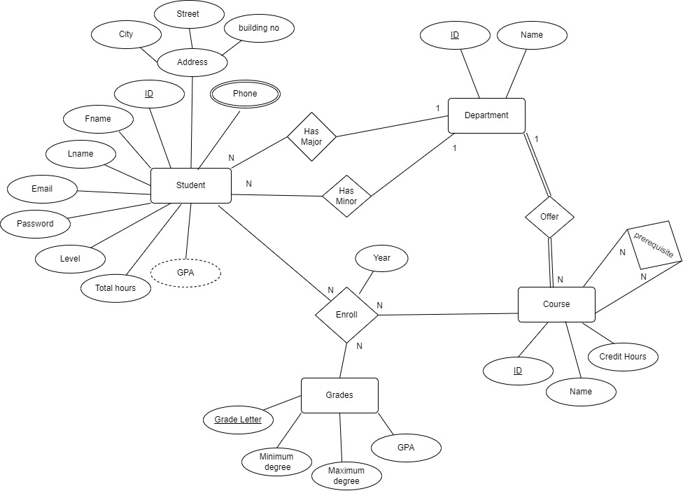

# Database Design 
## Overview
This folder contains essential files related to the database design for our project.
## ER Diagram
We will start with ER diagram to demonstrate how entities connected to each other 

### Entities

- **Student** 
- **Department**
- **Course**
- **Grades**

### Relationships

- #### Students - Department ( Binary Relationship )

    - **Has Major/Minor** : indicating that a student can have at most one major/minor department, but a major/minor department can be associated with multiple students

- #### Department - Course ( Binary Relationship )

    - **Offer** : indicating that each department must offer multiple courses, but each course is associated with exactly one department.

- #### Course - Course ( Unary Relationship )

    - **Prerequisite** : indicating that each course can have multiple prerequisites, and each prerequisite can be prerequisite for multiple courses.

- #### Student - Course - Grades ( Ternary Relationship )

    - **Enroll** : Each student can be enrolled in multiple courses and can receive a grade for each course. Each course can have multiple enrolled students, and each grade can be associated with multiple enrollments.
