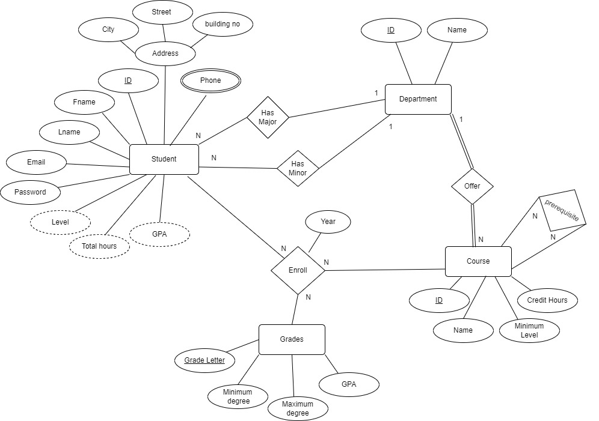

# Database Design 
This folder contains essential files related to the database design for our project.
## ER Diagram
We will start with ER diagram to demonstrate how entities connected to each other 

### Entities

- **Student** : Represent student data 
- **Department** : Represent departments exists in our university
- **Course** : Represent courses in our university
- **Grades** : Reference for grading information

### Relationships

- #### Students - Department ( Binary Relationship )

    - **Has Major/Minor** : indicating that a student can have at most one major/minor department, but a major/minor department can be associated with multiple students

- #### Department - Course ( Binary Relationship )

    - **Offer** : indicating that each department must offer multiple courses, but each course is associated with exactly one department.

- #### Course - Course ( Unary Relationship )

    - **Prerequisite** : indicating that each course can have multiple prerequisites, and each prerequisite can be prerequisite for multiple courses.

- #### Student - Course - Grades ( Ternary Relationship )

    - **Enroll** : Each student can be enrolled in multiple courses and can receive a grade for each course. Each course can have multiple enrolled students, and each grade can be associated with multiple enrollments.
## Normalization
In this section we will decide how tables in database will be
### 0NF :

- **Student** ( <u>student_ID</u>, major_department(**fk**) , minor_department(**fk**) , Fname , Lname , Email , Password , Level , Address , Phone )
- **Department** ( <u>department_ID</u>, name )
- **Course** ( <u>course_ID</u> , department_id(**fk**) , name , credit_hours , minimum_level )
- **Grades** ( <u>grade_letter<u> , min_degree , max_degree , GPA )
- **Course_prerequisite** ( <u>course_ID(**fk**)</u> , <u>prerequisite_ID(**fk**)</u> )
- **Enrollment** ( <u>student_ID(**fk**)</u> , <u>course_ID(**fk**)</u> , grade_letter(**fk**) , year )

### 1NF :
Handle the composite attribute "Address" and multivalued attribute "Phone"

- **Student** ( <u>student_ID</u>, major_department(**fk**) , minor_department(**fk**) , Fname , Lname , Email , Password , Level , city , street , building_no )
- **Student_phone** ( <u>student_ID(**fk**)</u> , <u>phone_number</u> )
- **Department** ( <u>department_ID</u>, name )
- **Course** ( <u>course_ID</u> , department_id(**fk**) , name , credit_hours , minimum_level )
- **Grades** ( <u>grade_letter<u> , min_degree , max_degree , GPA )
- **Course_prerequisite** ( <u>course_ID(**fk**)</u> , <u>prerequisite_ID(**fk**)</u> )
- **Enrollment** ( <u>student_ID(**fk**)</u> , <u>course_ID(**fk**)</u> , grade_letter(**fk**) , year )

### 2NF : Tables are already in 2NF. ( No partial dependencies )
### 3NF : Tables are already in 3NF. ( No transitive dependencies )