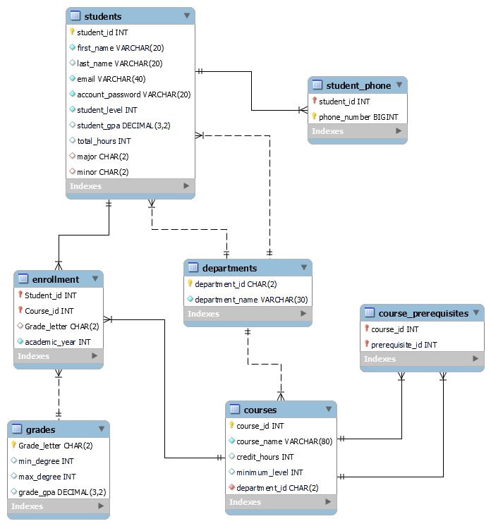

# Database - SQL Implementation 
This folder contains SQL Script for implement database tables in our schema
## EER Diagram

Enhanced Entity-Relationship (EER) provide a visual representation of the relationships among the tables in our model

