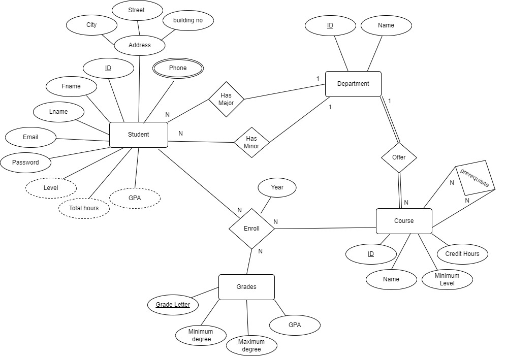
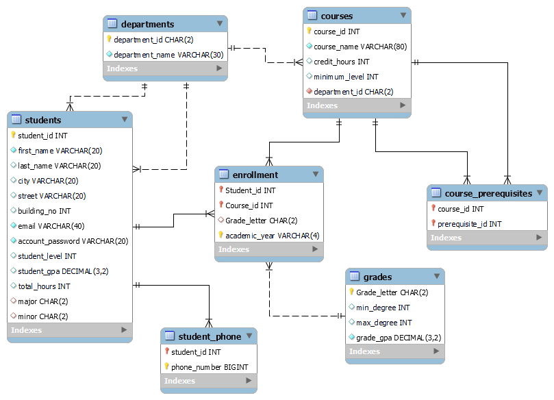
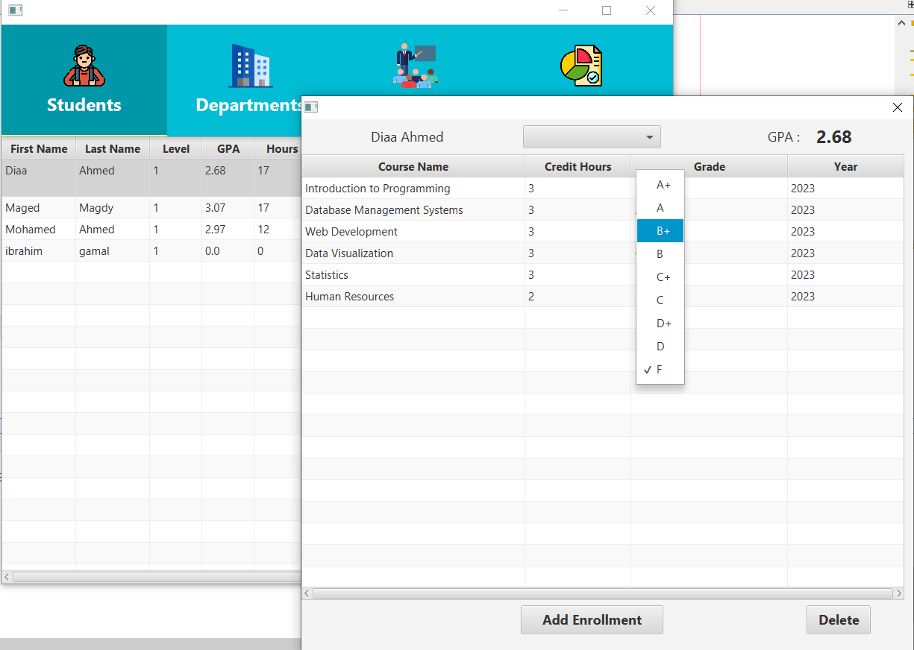
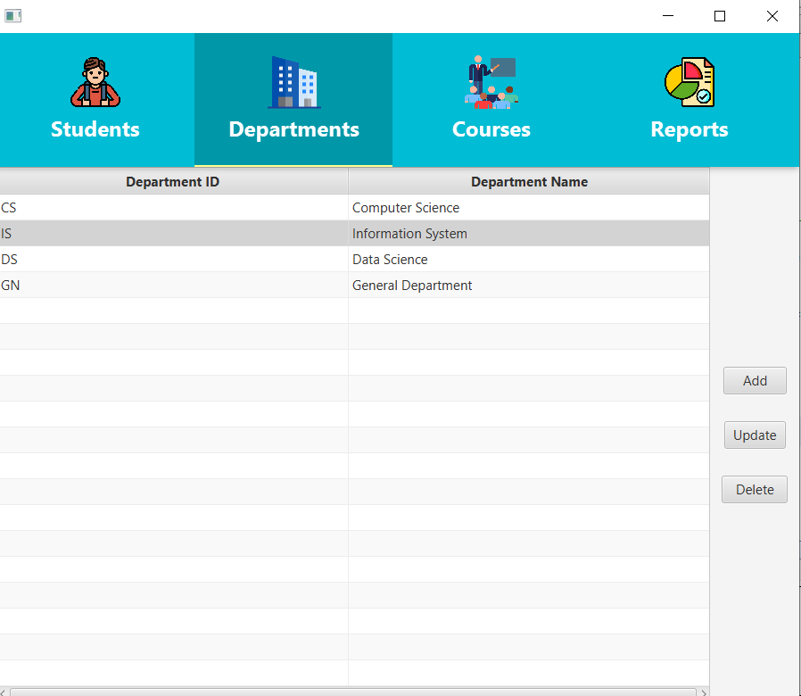
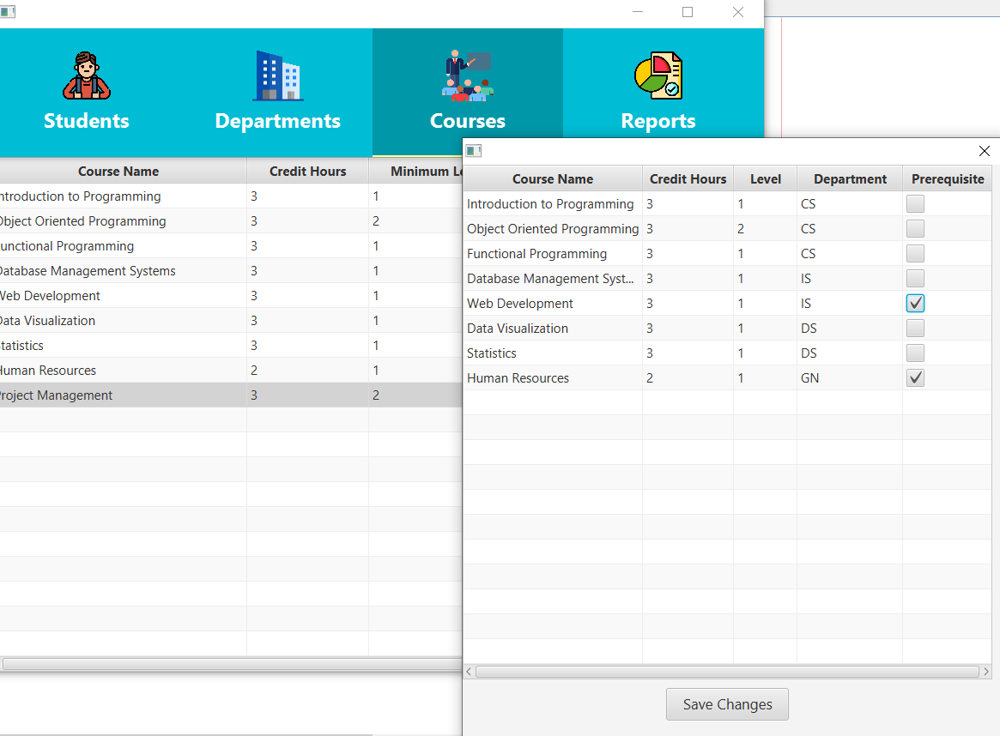
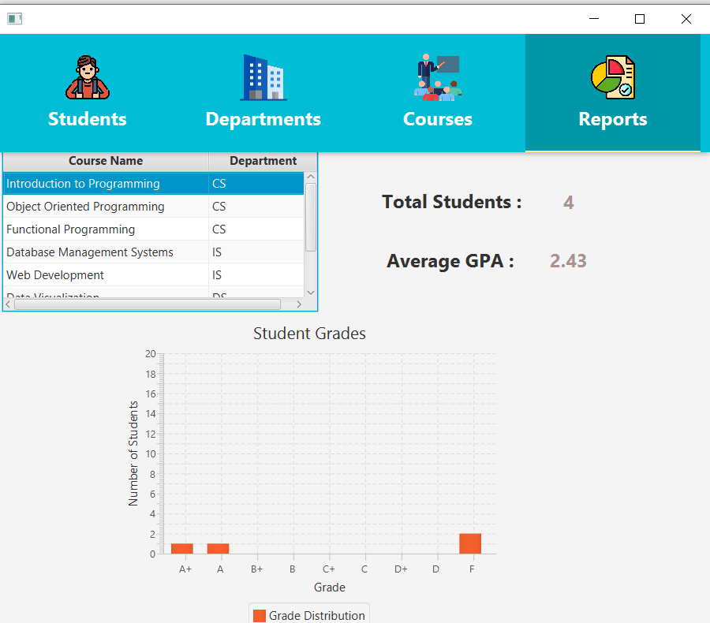

# University Data Management System

We're to represent a user-friendly system to manage university data using SQL, PLSQL, Java, and Bash scripting. Our project involves designing a database, adding functionality with PLSQL, automating tasks with Bash scripts, and building a Java application for data management

---
# 1- Database Design

We will start with ER diagram to demonstrate how entities connected to each other

## Normalization

In this section we will decide how tables in database will be

### 0NF :

- **Student** ( student_ID, major_department(**fk**) , minor_department(**fk**) , Fname , Lname , Email , Password , Level , Address , Phone )
- **Department** ( department_ID , name)
- **Course** (course_ID , department_id(**fk**) , name , credit_hours , minimum_level)
- **Grades** ( grade_letter , min_degree , max_degree , GPA )
- **Course_prerequisite** ( course_ID(**fk**), prerequisite_ID(**fk**) )
- **Enrollment** ( student_ID(**fk**) , course_ID(**fk**) , year , grade_letter(**fk**)  )

### 1NF :

Handle the composite attribute "Address" and multivalued attribute "Phone"

- **Student** ( student_ID, major_department(**fk**) , minor_department(**fk**) , Fname , Lname , Email , Password , Level , city , street , building_no )
- **Student_phone** ( student_ID(**fk**), phone_number )
- **Department** ( department_ID , name )
- **Course** (course_ID , department_id(**fk**) , name , credit_hours , minimum_level)
- **Grades** ( grade_letter , min_degree , max_degree , GPA )
- **Course_prerequisite** ( course_ID(**fk**), prerequisite_ID(**fk**) )
- **Enrollment** ( student_ID(**fk**) , course_ID(**fk**) , year , grade_letter(**fk**)  )

### 2NF : Tables are already in 2NF. ( No partial dependencies )

### 3NF : Tables are already in 3NF. ( No transitive dependencies )

---
# 2- SQL **Implementation**

In this section, we will outline the implementation of SQL scripts for creating the database and discuss important points regarding each entity

## Relations Mapping

1. **Students and Departments**:
    - The **`students`** table has two foreign key columns, **`major`** and **`minor`**, referencing the **`department_id`** in the **`departments`** table. This establishes a relationship between students and the departments they are associated with through their majors and minors.
2. **Student_Phone and Students**:
    - The **`student_phone`** table has a foreign key column **`student_id`** referencing the **`student_id`** in the **`students`** table. This relationship allows each student to have more than phone number .
3. **Courses and Departments**:
    - The **`Courses`** table has a foreign key column **`department_id`** referencing the **`department_id`** in the **`departments`** table. This relationship indicates the department to which each course belongs.
4. **Course_Prerequisites and Courses**:
    - The **`course_Prerequisites`** table has two foreign key columns, **`course_id`** and **`prerequisite_id`**, both referencing the **`course_id`** in the **`Courses`** table. This relationship establishes prerequisites for each course.
5. **Enrollment and Students/Courses/Grades**:
    - The **`Enrollment`** table has foreign key columns **`Student_id`**, **`Course_id`**, and **`Grade_letter`** referencing the **`student_id`**, **`course_id`**, and **`Grade_letter`** respectively in the **`Students`**, **`Courses`**, and **`Grades`** tables. This relationship links students to their enrolled courses and corresponding grades.

---

# 3- **PLSQL Implementation**

In this section, we will provide a detailed overview of the PL/SQL scripts in our system. These scripts are integral components of our database management system, facilitating various operations such as data manipulation, calculation of GPA, and other essential functionalities.

## 💡 Triggers

- **CUMULATIVE_GPA**
    
    
    This trigger ensures that the student's cumulative GPA is automatically adjusted whenever a grade is added or modified in the enrollment table, maintaining the accuracy and consistency of academic records.
    
- **UPDATE_COURSE_HOURS**

The trigger ensures that whenever the credit hours of a course are updated, the GPA and total hours of all enrolled students in that course are adjusted accordingly to maintain accuracy in academic records.

- **DELETE_ENROLLMENT**

When a student is removed from a course, their GPA is immediately updated. This helps maintain accurate records, ensuring that the student's academic data is always current and correct, even after they're no longer enrolled in a course.

- **DELETE_COURSE**

When a course is deleted, the academic records of all enrolled students are properly adjusted. It maintains the accuracy of student data by updating their GPA and total hours, and it also removes enrollment records associated with the deleted course, ensuring data consistency in the system.

- **COURSES_TRG - STUDENTS_TRG**
    
    
    These triggers ensure that each new entry in the "COURSES" and "STUDENTS" tables receives a unique identifier generated by the respective sequence, improving data integrity and consistency. If an ID is not provided during insertion, the trigger automatically assigns the next available ID from the corresponding sequence.
    

- **UPDATE_STUDENT_LEVEL**

This trigger ensures that the student's level is updated automatically based on their progress, simplifying the management of student data in the system

- If  total hours completed by the student are less than or equal to 40, their level is set to 1.
- If  between 41 and 80, their level is set to 2.
- If  between 81 and 120, their level is set to 3.
- For total hours exceeding 120, the student's level is set to 4.

- **SET_YEAR**

This trigger ensures that each new enrollment record has an academic year assigned to it. If the academic year is not specified in the new enrollment record, the trigger automatically sets it to the current year (2024)

## 💡 Functions

- **AVERAGE_GPA_COURSE**

This function calculates the average GPA of students who are enrolled in a specific course.

## 💡 Procedure

- **GET_AVAILABLE_COURSES**

This procedure finds out which courses a student can take based on their current level and what courses they've already passed.

- This procedure helps students find out which courses they can take next.
- It checks the student's current level and what courses they've already passed.
- Then, it figures out which courses are available for the student to take next, based on their level and what they've done before.
- Finally, it gives back a list of these available courses for the student to choose from.

---
# 4- **Automation Scripts**

In this section, we'll discuss our Bash script designed to automate various tasks within our systems.

- **Backup_database.sh**

This Bash script automates database schema backups. It sets up parameters, creates necessary    directories, exports the schema using **`expdp`**, and logs backup status. If successful, it moves backup files to a timestamped directory. If unsuccessful, it displays an error message and logs the error.

- **Monitor.sh**

 This Bash script keeps an eye on two important things:

1. **Disk Space:** It checks how much space is left on the computer's disk. If it's getting too full (above 82% full), it sends a warning message and shows a pop-up alert.
2. **CPU Usage:** It also looks at how busy the computer's CPU is. If it's working too hard (above 50% usage), it sends another warning message and shows another pop-up alert.

---

# 5- **Java Application Development**

**In this section, we will explore the graphical user interface (GUI) aspect of our system, which facilitates administrative tasks related to students, courses, departments, and enrollment. The GUI provides functionalities for administrators to easily manage these aspects, including adding, deleting, updating, and viewing summarized reports.**

## **Structure**

- **Project Structure:** Follows the Model-View-Controller (MVC) pattern.
- **Packages:**
    - **DAO Controller:** Contains two main classes:
        - "DataRetrieval" for accessing the database to retrieve data.
        - "DataModification" for adding, deleting, or updating data.
        - “ReportDAO” for getting data for showing report
    - **DBConnection Class:** Follows the Singleton pattern to ensure a single connection to the database is maintained.
- **View Package:** Contains FXML files for each view, defining the layout and structure of the user interface.
- **View Controllers:** Corresponding controllers for each view manage their behavior.
- **Model (DTO):** Data Transfer Objects (DTOs) in the "DTO" package facilitate data transfer between the DAO and views.

---

# GUI

Our system comprises four tabs, each dedicated to managing specific aspects:

## **Students**

- Displays a table of all university students along with their data.
- Provides buttons for adding, deleting, and updating students.
- To perform any modification, users must first select the student they wish to modify from the table.
- Double-clicking on a student allows users to add courses to them.

## **Departments**

This tab provides access to department data 

- Admin can add, update, or delete departments.
- Deletion is only permitted if the department has no students majoring or minoring in it, and if it has no associated courses.

## **Courses**

In this tab administrators can manage courses within the system and by double click on the course 

he can add  

- Admin can perform operations such as adding, deleting, and updating course data.
- Deleting a course also removes all enrolled students from their GPA records.
- Double-clicking on a course opens a pop-up window to add prerequisites for that course.

## **Reports**

- Admin can view all courses and the number of students enrolled in each.
- The tab also displays the average grade of all students enrolled in each course.
- Clicking on a course provides detailed information, including a bar chart showing the distribution of grades obtained by students throughout the course's history.

